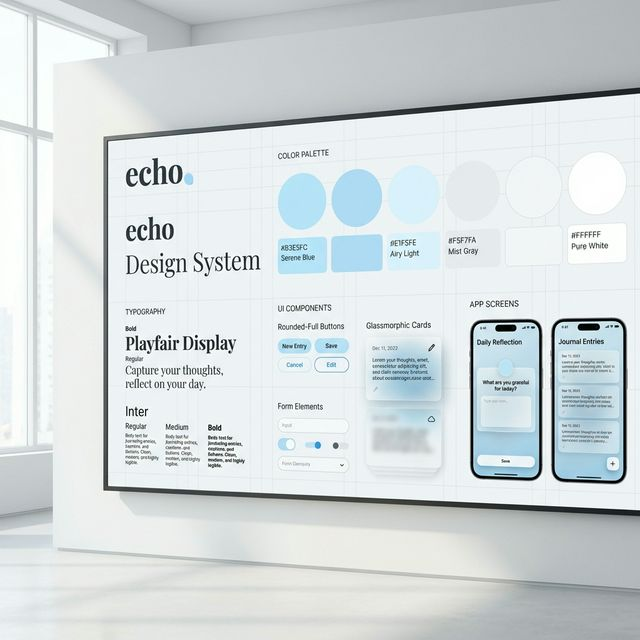

# Echo Design System & Branding Guide

## 1. Brand Essence
Echo is built for **tranquility, reflection, and clarity**. The brand communicates trust and modern simplicity, providing users with a "digital sanctuary" for their thoughts and insights.

- **Voice & Tone**: Calm, encouraging, professional but approachable.
- **Mission**: To provide a seamless, AI-enhanced journaling experience that focuses on the human element.
- **Visual Personality**: Airy, soft-edged, high-contrast typography, and subtle motion.

---

## 2. Color Palette
The Echo palette utilizes modern OKLCH values for superior color consistency and accessibility.

### Primary Colors
- **Echo Blue (Primary)**: `oklch(0.67 0.1612 256.84)` (Approx. `#4E95F6`)
  - Used for primary actions, critical UI markers, and the brand dot.
- **Deep Navy (Accent)**: `oklch(0.35 0.0736 256.04)` (Approx. `#1E3A5F`)
  - Used for large headings and high-contrast readability.

### Neutral Colors
- **Page Background**: `oklch(1 0 0)` (Pure White) or `oklch(0.98 0.005 256.84)` (Soft Mist)
- **Text (Foreground)**: `oklch(0.129 0.042 264.695)` (Slate Gray)
- **Muted**: `oklch(0.92 0.02 256.84)` (Light Gray) - used for secondary text and disabled states.

### Semantic Colors
- **Secondary (Warmth)**: `oklch(0.67 0.15 40)` (Peach/Orange) - used for highlights or special alerts.
- **Destructive**: `oklch(0.62 0.19 27)` (Soft Red) - used for danger actions.

---

## 3. Typography
A harmonic pairing of Serif and Sans-Serif fonts.

### Headings: Playfair Display (Serif)
*Used for product personality and high-level hierarchy.*
- **Logo**: 24px, Medium, tracking-tight.
- **H1 (Hero)**: 60px, Medium, Line-height 1.1.
- **H2 (Section)**: 36px, Medium.

### Body & UI: Inter (Sans-Serif)
*Used for utility, readability, and interface elements.*
- **Body Text**: 16px, Regular, Line-height 1.6.
- **Buttons / Navigation**: 14px, Medium.
- **Small / Muted**: 12px, Regular.

---

## 4. UI Components

### Buttons
- **Shape**: Fully Rounded / Capsule (`rounded-full`).
- **Primary**: Solid Echo Blue with White text.
- **Interaction**: 
  - Hover: -2px translate-y, soft shadow (`shadow-hover`).
  - Active: Scale down slightly (0.98x).
  - Transitions: `duration-300 ease-out`.

### Cards (Glassmorphism)
Echo uses a signature **Glass Card** style to create depth without clutter.
- **Corners**: `rounded-2xl` (16px).
- **Styling**: `bg-white/80 backdrop-blur-sm border border-white/50 shadow-subtle`.
- **Hover**: Subtle border increase and shadow expansion.

### Badges / Pills
- **Shape**: Full capsule.
- **Styling**: Light Blue background with Primary Blue text for high legibility and a soft feel.

---

## 5. Layout & Spacing
- **Container**: Max-width `1200px` with `2rem` side padding.
- **Vertical Rhythm**: 
  - Section Spacing: `8rem` (128px) for large sections.
  - Card Spacing: `2rem` (32px) gutter.
- **Grid**: Standard 12-column grid for complex layouts, or flexbox-based centered content for landing pages.

---

## 6. Visual Language
- **Borders**: Subtle `1px` borders using `oklch(0.92 0.01 256.84)` (Light Gray) or semi-transparent white on glass cards.
- **Shadows**:
  - `subtle`: `0 10px 30px -12px rgba(0, 0, 0, 0.1)`
  - `hover`: `0 10px 40px -12px rgba(78, 149, 246, 0.25)`
- **Animations**:
  - `fade-in`: Smooth opacity shift with a small vertical slide.
  - `reveal-text`: Width expansion or slide-in for headlines.

---

## 7. Iconography
- **Style**: Thin line icons (Lucide or similar).
- **Color**: Echo Blue for active icons, Muted Gray for inactive.
- **Size**: 20px for primary UI, 16px for inline text icons.
